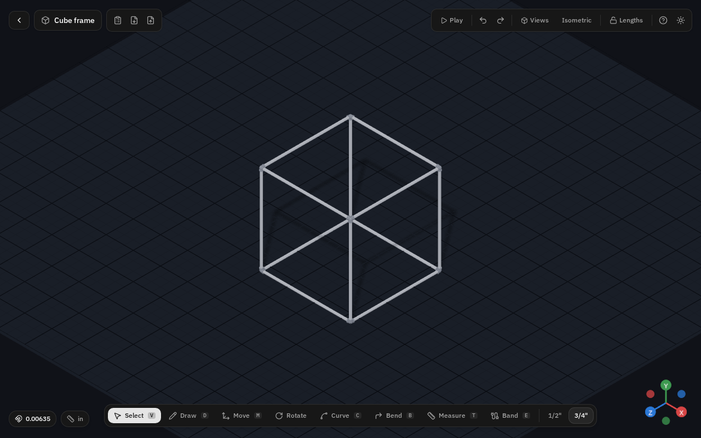
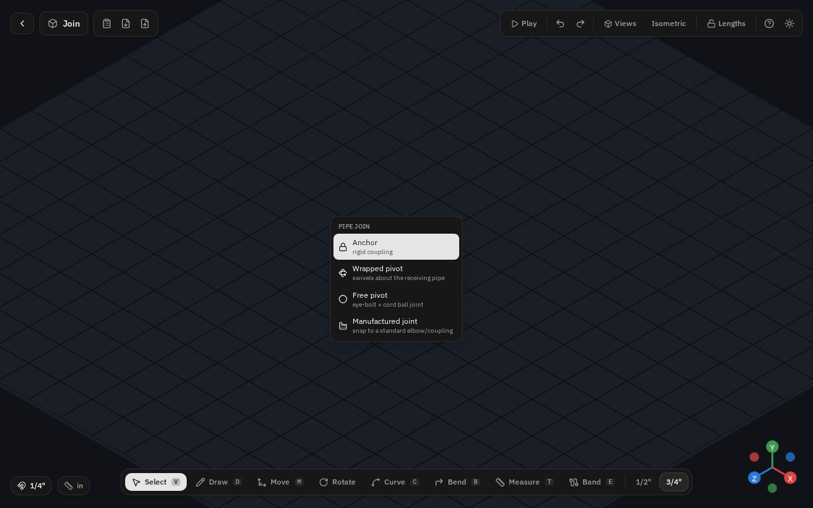
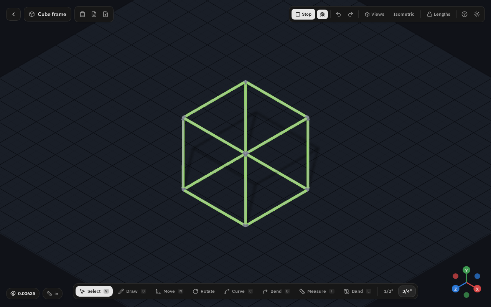

# PVC Builder

**A 3D-first, SketchUp-for-PVC design studio.** Draw pipe runs in a 3D viewport and the correct
SCH 40 fittings are inferred and drawn automatically as members join — then articulate, simulate,
and get a shop-ready cut list.

**▶ Live app: [pvc-builder.joemattie.com](https://pvc-builder.joemattie.com)** · No install, no
account, runs entirely in the browser.



---

## What it is

PVC Builder is a browser-based CAD tool for designing things out of ½" and ¾" SCH 40 PVC pipe. You
draw in a true-to-scale 3D viewport with SketchUp-style snapping and inference; the app classifies
every junction into the right fitting (coupling, elbow, tee, cross, reducer, 3-way corner) and draws
it procedurally at true outside diameter. Add pivots to make it move, run a rigid-body simulation to
see how it hangs and swings, and export a cut list with socket take-offs — or the whole design as
JSON.

It's the visual, fast counterpart to a rigorous test-first PVC engineering tool: full 3D polish, with
the geometry / fitting / physics math kept pure and unit-tested.

## Features

- **Draw** straight pipe with SketchUp-style snapping (ends, along-pipe, axis inference), 3D drawing
  with Shift axis-lock on any axis (incl. Y), and typed exact lengths while drawing.
- **Fittings inferred automatically** — couplings, 45°/90° elbows, tees, crosses, reducers, and
  3-way corner elbows, drawn at true OD, with conflicts flagged.
- **Heat-formed (bent) pipe** as smooth splines with a developed-length + bend schedule and a
  minimum-bend-radius check.
- **Joints** at any connection: `anchor` (rigid), `wrapped` (1-DOF revolute swivel about the
  receiving pipe), `free` (3-DOF ball hub for any number of pipes), and **manufactured** (snap the
  branch to a standard off-the-shelf fitting).
- **Articulate & simulate** — a deterministic closed-form kinematics solver (lock lengths → pose
  with sliders or drag-to-pose, lengths preserved) *and* a full **rigid-body physics** Play mode
  (CrashCat) with a debug overlay.
- **Elastic bands** — pre-tensioned springs between pipe ends / along-pipe points that pull in the
  simulation, with a tension slider.
- **Groups** (G to group, double-click to enter/fade the rest), **copy/cut/paste**, multi-select
  move/rotate gizmos, endpoint drag + length arrows, arrow/numpad nudge.
- **BOM / cut list** — centre-to-centre spans minus fitting take-offs, wrapped-union + end-cap
  allowances, manufactured-tee run splitting, CSV export.
- **Units** pill (mm / cm / decimal & fractional inch), **dark mode** by default, camera view
  presets, JSON export/import, autosave (IndexedDB), and bundled examples (articulated arm, cube
  frame, T-rex rigid / universal-pivot / random-wrapped).
- **Fast on dense models** — nearly all repeated geometry is instanced, so even the ~3,000-part
  T-rex renders in a handful of draw calls.

See the full **[User Guide](docs/USER-GUIDE.md)** (with screenshots) or press **?** in the app.

|  |  |
|---|---|
|  |  |
| Right-click a junction to pick a joint mode | Rigid-body simulation with the physics-debug overlay |

## Tech stack

Vite · React 19 · TypeScript · three.js + react-three-fiber + drei · CrashCat (rigid-body physics) +
mathcat · Zustand + Zundo + Immer · Zod (schema + migrations) · Dexie (IndexedDB) · Tailwind CSS +
Radix UI · Biome · Vitest · Playwright.

## Getting started

Node is provided by nvm (Node 26 / npm 11):

```bash
export NVM_DIR="$HOME/.config/nvm"; . "$NVM_DIR/nvm.sh"   # once per shell
npm install
npm run dev          # Vite dev server
```

Other commands:

```bash
npm run build        # production build
npm run preview      # serve the production build
npm run typecheck    # tsc --noEmit
npm run lint         # biome check .
npm run test         # vitest run  (the primary loop)
npm run e2e          # playwright smoke against the built app
```

**Definition of done for any change:** `typecheck`, `lint`, and `test` green, `build` succeeds and the
built app works.

## Architecture

The design is organized around **pure cores behind narrow interfaces**, so the geometry, fitting, and
physics logic can be tested without three.js/React/engine types leaking in:

- **`Design`** is the single source of truth — a **Zod** schema (SI units internally, imperial is
  display-only), with a migration runner for every schema bump. Holds `nodes`, `members`
  (straight | heat-formed), `joints`, `groups`, `elastics`, and more.
- **`resolveFittings(design)`** — a pure function classifying pipe ends into fittings / conflicts;
  feeds both rendering and the BOM.
- **`solve(design, inputs, mode)`** — the kinematics solver boundary (no three/UI/physics types
  cross it); acceptance-tested against closed-form.
- **`bom(design)`** — pure cut-list math.
- **Rendering** (three.js/R3F) is the impure outer layer; **state** is Zustand + Zundo (undo) +
  Immer, split into a persisted/undoable document store and a transient editor store.

Start with **[`docs/CODE-MAP.md`](docs/CODE-MAP.md)** — the index of the codebase; every source
directory has a `CONTEXT.md` orientation card. **[`CLAUDE.md`](CLAUDE.md)** holds the working
conventions and **[`DECISIONS.md`](DECISIONS.md)** logs the choices made (newest first). The product
spec lives in `docs/planfiles/`.

## Deploy

CI deploys `main` to Cloudflare Pages at **[pvc-builder.joemattie.com](https://pvc-builder.joemattie.com)**
(production mirror at `pvc-builder.pages.dev`). Every push to `main` is versioned (see the in-app
changelog / `src/changelog.ts`).

## Scope

½" and ¾" SCH 40 PVC only; no backend, no network, static assets only. Fitting take-off constants are
documented estimates intended to be replaced with manufacturer tables.
