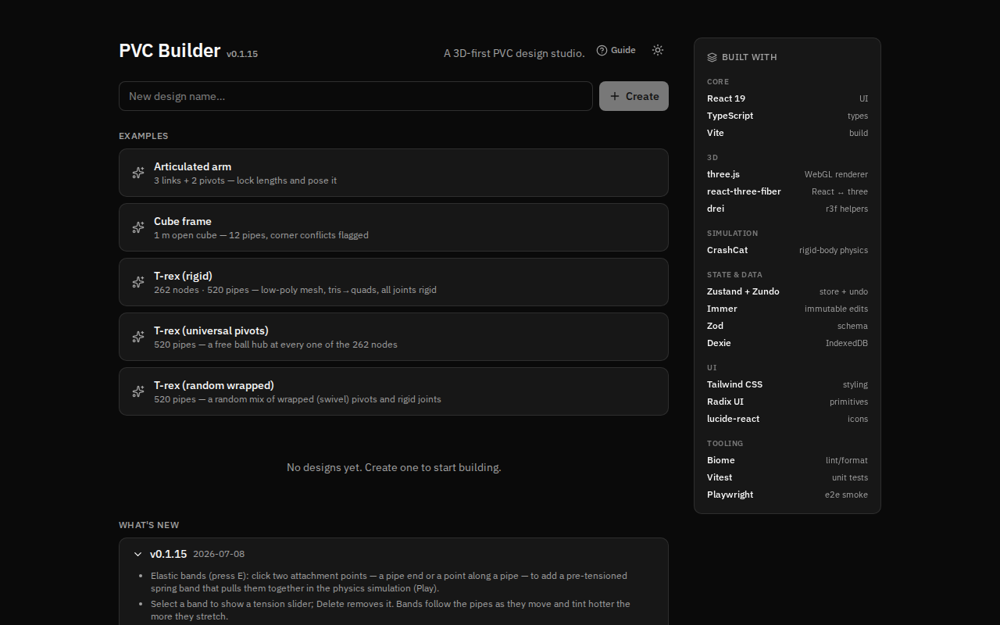
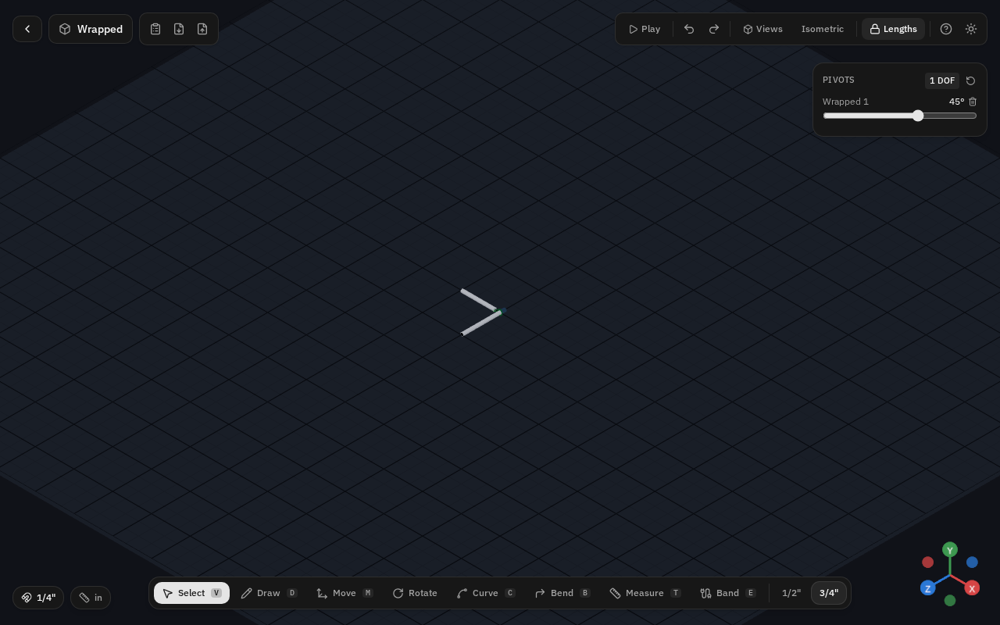
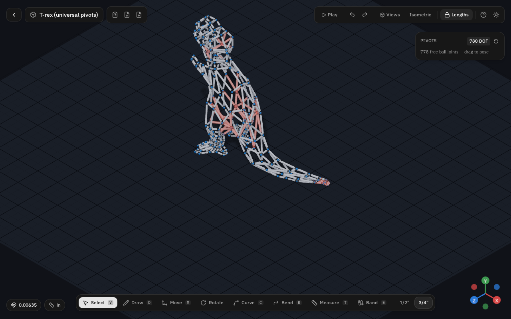
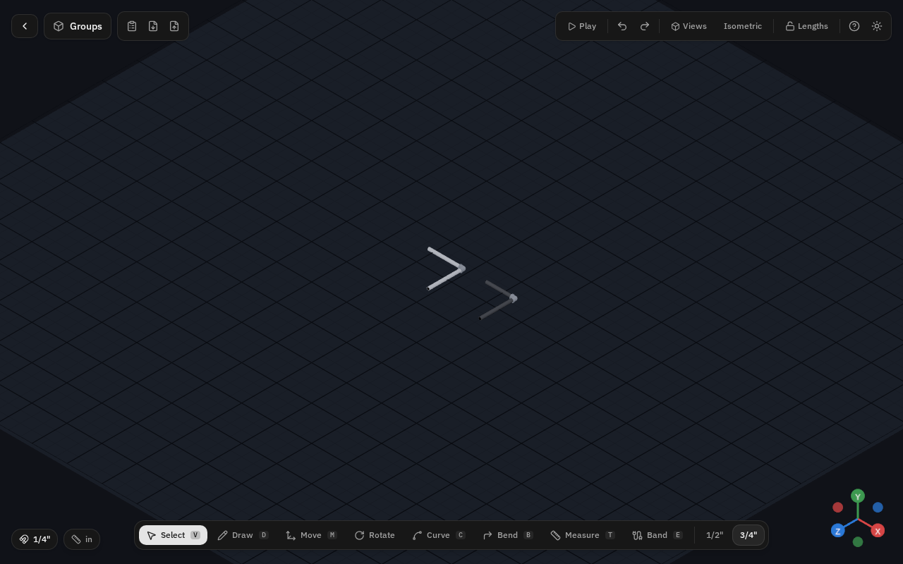
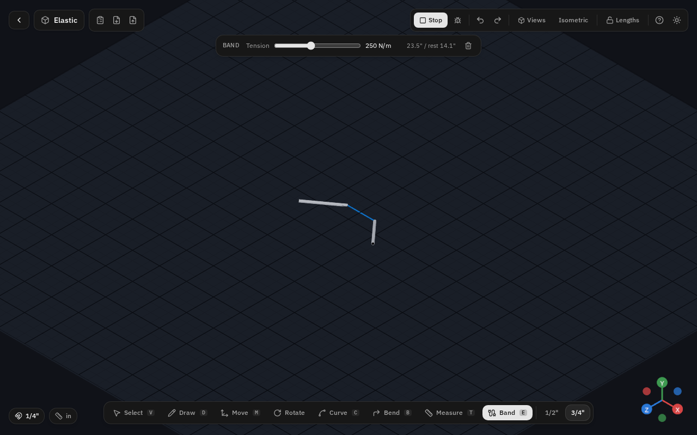
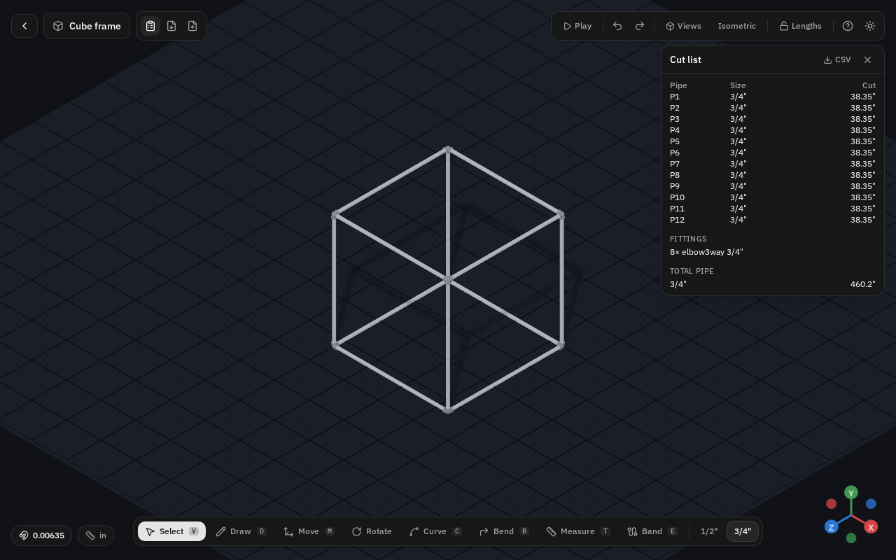

# PVC Builder — User Guide

PVC Builder is a **3D-first design studio for PVC pipe** (think "SketchUp for PVC").
You draw pipe runs in a 3D viewport and the correct **SCH 40 fittings** — couplings,
elbows, tees, crosses, reducers — are inferred and drawn automatically as members
join. You can bend pipe, add articulating joints, simulate the result with rigid-body
physics, and export a cut list. Scope is **1/2" and 3/4" SCH 40 PVC**.

Everything is stored in metres/radians internally; imperial is display-only. There is
no backend — projects live in your browser (IndexedDB) and export to a single JSON file.

> In-app help: click the **?** button in the editor's top-right toolbar, or the
> **Guide** button on the project-list page, for a quick shortcut reference.

---

## Contents

1. [Getting started](#getting-started)
2. [The viewport](#the-viewport)
3. [Tools](#tools)
4. [Drawing pipe](#drawing-pipe)
5. [Joints](#joints)
6. [Editing](#editing)
7. [Groups](#groups)
8. [Elastic bands](#elastic-bands)
9. [Sizes and units](#sizes-and-units)
10. [Simulate (Play)](#simulate-play)
11. [BOM / cut list](#bom--cut-list)
12. [Persistence](#persistence)
13. [Keyboard shortcut reference](#keyboard-shortcut-reference)
14. [Right-click reference](#right-click-reference)

---

## Getting started

The landing page (the **project list**) is where you create, open, and delete designs.

- **Create a design** — type a name in the "New design name…" field and press
  **Create** (or Enter).
- **Open / delete** — existing designs are listed with their last-edited time. Click a
  design to open it, or the trash icon to delete it.
- **Examples** — a set of bundled sample models you can open with one click. Each opens
  as a new project so you can experiment freely:
  - **Articulated arm** — 3 links + 2 pivots; lock lengths and pose it.
  - **Cube frame** — a 1 m open cube (12 pipes) with corner conflicts flagged.
  - **T-rex (rigid)** — a 262-node / 520-pipe low-poly mesh, all joints rigid.
  - **T-rex (universal pivots)** — the same mesh with a free ball hub at every node.
  - **T-rex (random wrapped)** — a random mix of wrapped (swivel) pivots and rigid joints.
- **Dark mode** — the sun/moon button (top-right of the header) toggles day/night. Dark
  is the default. The preference is remembered.
- **What's new** — the changelog is at the bottom of the page; **Built with** (the
  technology stack) is in the sidebar.

Once a design is open you're in the **editor**. The back arrow (top-left) returns you to
the project list. Work autosaves continuously.

---

## The viewport

The 3D viewport fills the screen; controls sit over it as compact CAD chrome.

- **Projection** — the **Isometric / Perspective** button (top-right) toggles between an
  orthographic isometric camera (the default) and a perspective camera.
- **Orbit / pan / zoom** — drag with the **right mouse button** to orbit, and use the
  **scroll wheel** to zoom (cursor-anchored). The camera keeps its target and distance
  across the projection toggle.
- **Views** — the **Views** dropdown snaps the camera to a named view: four isometric
  corners (NE / NW / SE / SW) or the orthographic faces (Top / Front / Back / Right /
  Left).
- **Axis gizmo** — the little X/Y/Z triad in the bottom-right corner shows the current
  orientation (X red, Y green, Z blue).

Each design **remembers its own camera pose, tool, projection, and draw size**, so it
opens exactly as you left it — it does not inherit the previous design's view.

### Workflow and status

The editor is organized around three workflows, whether they appear as explicit tabs/status
chrome or as the current floating controls:

- **Design** — draw, select, resize, bend, group, snap, measure, and add guides.
- **Fabricate** — inspect fittings, warnings, BOM/cut lengths, bend schedules, and export CSV/JSON.
- **Simulate** — lock lengths, inspect pivots/free joints, tune bands/mannequin/damping, and run Play.

When a top/status bar is present it summarizes the active workflow, document/save state, warning
count, and whether you are looking at document geometry or live simulation positions. In the compact
chrome, the same state is split across the document controls, conflict markers, BOM panel, Lengths
lock, and Play/debug controls.

---

## Tools

The **tool pillbox** at the bottom-center holds every tool with its icon and hotkey
badge. Press a hotkey or click a tool to switch. **Space** always returns to Select.

| Tool | Hotkey | What it does |
|---|---|---|
| **Select** | `V` | Pick pipes, endpoints, joints, bands, and measurements; drag handles; marquee-select. |
| **Draw** | `D` | Draw straight SCH 40 pipe runs. |
| **Extend** | `P` | Push a new pipe out of an existing pipe end along a shown direction. |
| **Move** | `M` | Translate the selection with a 3-axis gizmo. |
| **Rotate** | `R` | Spin the selection with a 3-axis gizmo. |
| **Curve** | `C` | Draw heat-formed (bent) pipe as a smooth spline. |
| **Bend** | `B` | Drag a bend into an existing straight pipe. |
| **Measure** | `T` | Drop a persistent tape-measure dimension. |
| **Guide** | `Q` | Place construction guide lines; Shift+Q clears them. |
| **Band** | `E` | Add an elastic band (a spring) between two attachment points. |

To the right of the tools is the **pipe size** switch (`1/2"` / `3/4"`) — the size the
Draw tool lays.

### Select (V)
The default tool. Click a pipe to select it (its inspector appears at top-center). Click
empty space to deselect. Drag a **marquee** (rubber-band) rectangle to select many pipes
at once — see [Multi-select](#multi-select). With a pipe selected you get endpoint drag
handles and length arrows — see [Editing](#editing).

### Draw (D)
Lays straight pipe. See [Drawing pipe](#drawing-pipe).

### Move (M) / Rotate
Show a 3-axis gizmo on the selection. Drag a gizmo axis to translate (Move) or rotate
(Rotate) the whole selection along/about that axis. Works on multi-selections.

### Extend (P)
Shows push-cylinder handles on pipe ends. Click one to start a Draw path locked to that
direction for the first segment.

### Curve (C)
Draws **heat-formed** pipe: click a series of points and the tool sweeps a smooth
Catmull-Rom spline through them, computing the **developed length** and a **bend
schedule**. Bends tighter than the minimum bend radius are flagged. Press Enter/Esc
(or right-click) to finish the spline. The selected-pipe inspector shows the developed
length, bend count, and a **tight bend** warning when applicable.

### Bend (B)
Turns an existing straight pipe into a formed one: **drag the pipe's tube** and a bend
follows the cursor; drag the orange control points to fine-tune. Two options appear in
the **Bend pill** (top-center) while this tool is active:
- **Lock end angles** — keeps the pipe's ends straight so the bend eases in from a short
  distance past each end.
- **Lock length** — holds the pipe's material length, so the far end draws in as you bend
  rather than the pipe growing.

A plain click on a bent pipe adds another control point.

### Measure (T)
Two-click tape measure: click a start point and an end point (both snap to pipe ends /
along pipes) to drop a persistent dimension line with a label. Measurements are
selectable and deletable (Delete). Press Esc to cancel a measurement in progress.

### Guide (Q)
Click a pipe, then place a parallel construction guide line. Type a distance before
pressing Enter for an exact offset. Guides act as snap aids; **Shift+Q** clears them.

### Band (E)
Adds elastic bands — see [Elastic bands](#elastic-bands).

---

## Drawing pipe

With the **Draw (D)** tool, click to place the start of a run, then click again for each
subsequent point; the run chains segments until you finish. Press **Enter**, **Esc**, or
**right-click** to end the path. Where segments meet, fittings are inferred automatically.

**Click vs click-drag** — a single click places a point and continues the path; a
click-and-drag draws exactly one segment and drops it on release.

### Snapping and inference

Drawing uses SketchUp-style snapping so runs line up cleanly. The **snap pill**
(bottom-left, magnet icon) controls it:

- **Grid** — the increment new points snap to. Options are unit-dependent (imperial:
  Off / 1/8" / 1/4" / 1/2" / 1"; metric: Off / 5 / 10 / 25 / 50 mm). The default is 1/4".
- **Snap to ends** — snap the cursor onto existing pipe ends / junctions (at any height,
  in screen space).
- **Snap along pipes** — snap onto a point along an existing pipe's centre-line (this is
  how you start a branch mid-run).
- **Axis inference** — infer and lock to the X/Y/Z axis directions as you draw.

The snap settings are a workspace preference (remembered across designs).

### Typed exact lengths

While a path is open, just **start typing a number** (with optional units, e.g. `10cm`,
`1/2"`, `10ft`) — it goes into the **length pill**. Press **Enter** to commit the segment
at exactly that distance in the current direction. Backspace edits the entry; Esc clears
it. The number is parsed in your current display units.

### Axis lock (including Y)

Hold **Shift** while drawing to lock the segment to a single world axis — **X, Y, or Z**.
This is how you draw straight up (the Y axis) as well as along the ground plane. Shift is
toggleable mid-drag (press to switch modes without holding).

### Branching off a pipe

**Double-click a pipe** to start a new branch from that point on the run. Combined with
**Snap along pipes**, this lets you tee into an existing member; the fitting resolver
turns the junction into the appropriate tee (or flags a conflict).

---

## Joints

Where a pipe meets the structure, **right-click the junction** (or use the Joint controls
in the selected-pipe inspector) to choose how it connects. The options are gated by the
geometry:

- **Anchor** — a **rigid** connection. On an intact run it becomes a flattened + screwed
  tee; end-to-end it's a rigid coupling. A rigid anchor automatically uses a manufactured
  fitting when the angle matches (e.g. a 90° tee) and a wrap + bolt otherwise — no manual
  choice needed.
- **Wrapped pivot** — a joint that **swivels about the receiving pipe's own axis** (a
  1-DOF revolute). The branch pipe wraps the receiver and rotates around it.
- **Free hub / Free pivot** — an **eye-bolt + cord ball joint** (3-DOF spherical). When
  two or more butted ends meet at a point, choosing Free makes a **Free hub** where *all*
  the pipes there share one ball joint. On an intact run it's a saddle eye-bolt.
- **Manufactured joint** — snap the connection to a **standard elbow / coupling** (the
  real off-the-shelf fitting) instead of a fabricated wrap.

The **swap gizmo** (the ↔ button in the inspector, for a non-on-body wrapped pivot) swaps
which pipe wraps which at the joint.

Joints only animate when **lengths are locked** — see [Simulate (Play)](#simulate-play).
A wrapped pivot gets an angle slider; a free hub is posed by dragging it directly.

---

## Editing

With a pipe selected (Select tool), the **inspector** at top-center shows its size and,
for straight pipe, an **editable exact length** — type a value and press Enter (or blur
the field) to resize it. For formed pipe it shows the developed length, bend count, and
any tight-bend warning. The inspector also hosts the Joint mode controls and a delete
button.

- **Endpoint drag handles** — drag a pipe's endpoint to move it. Floating nodes keep
  their height as you drag (view-aware). Hold **Shift** to axis-lock the drag; hold
  **Ctrl** to **detach** the end from its junction (release re-welds it if it lands back
  on a node). Ctrl/Shift are toggleable mid-drag.
- **Length arrows** — drag the arrows along the pipe's axis to resize it (works on
  vertical pipes too).
- **Nudge** — with a selection, the **arrow keys** (and numpad arrows) move it one grid
  step in the X/Z ground plane. **Ctrl+Up / Ctrl+Down**, or **Home / End** (or numpad
  7/9 up, 1/3 down), move it in **Y**.
- **Delete** — **Delete** or **Backspace** removes the selected pipe(s) (also the selected
  band or measurement).

### Multi-select

Drag a **marquee** rectangle with the Select tool to select several pipes at once, using
CAD window/crossing semantics:
- **Left → right** (blue, solid box) = **window** — selects only pipes fully *contained*.
- **Right → left** (green, dashed box) = **crossing** — selects any pipe the box *touches*.

Multi-selections work with Move/Rotate, copy/paste, size changes, grouping, and nudging.

### Copy / cut / paste

- **Ctrl+C** — copy the selection.
- **Ctrl+X** — cut the selection.
- **Ctrl+V** — paste. The pasted copy is offset (past the original's bounding box plus a
  grid gap) so it clears the original, and it comes in selected.

The clipboard is transient (not saved, not part of undo).

---

## Groups

Groups let you treat a set of pipes as one unit.

- **G** — group the current selection.
- **Shift+G** — ungroup.
- **Click any grouped pipe** — selects the *whole* group.
- **Double-click a group** — *enter* it; the other pipes **fade and go inert** so you can
  edit the group's members in isolation. Pipes you draw while inside join that group.
- **Esc** — exit the group.

Snapping to a grouped object **from outside** works, but its union is **deferred** until
the group is dissolved — ungrouping auto-solves any unions the boundary held back.

---

## Elastic bands

An **elastic band** is a pre-tensioned spring member used in the physics simulation.

- With the **Band (E)** tool, **click two attachment points**. Each end snaps to a pipe
  **end** or a point **along a pipe**. A band is created only when both ends attach (a
  click off geometry is ignored). Bands start pre-tensioned (never slack).
- **Select a band** to reveal its **tension slider** (0–600 N/m) along with its current
  and rest span, and a delete button. **Delete** also removes a selected band.
- In **Play**, each band pulls its two ends together with a spring force; bands **follow
  the pipes** as they move and **tint hotter** (toward red) the more they stretch.

---

## Sizes and units

- **Pipe size** — the `1/2"` / `3/4"` switch (in the tool pillbox) sets the size the Draw
  tool lays. **Right-click a pipe** to change an existing pipe's size (or the whole
  multi-selection); unions re-resolve automatically and reducing tees are derived.
- **Display units** — the **units pill** (bottom-right, ruler icon) chooses how lengths
  are *shown*: decimal inches (`10.5"`), fractional inches (`10 1/2"`), millimetres, or
  centimetres. This is display-only — everything is stored in SI, so switching units
  never changes the model. The default is decimal inches.

Scope is **1/2" and 3/4" SCH 40 PVC** only; fittings are drawn at true outside diameter.

---

## Simulate (Play)

- **Lengths lock** — the **Lengths** toggle (lock icon, top-right) decides how the model
  moves. *Unlocked*, direct manipulation edits node positions freely (design mode — not
  physics). *Locked*, every member length is held and the model becomes a **mechanism**:
  wrapped pivots and free hubs articulate while every pipe keeps its length.
- **Pose controls** — in locked mode, the **Pivots panel** (top-right) shows a mobility
  readout (degrees of freedom, or "over-locked"), an **angle slider per wrapped pivot**,
  and a reset button. **Free ball joints have no slider** — pose them by dragging them
  directly. Use the panel's reset button to reset pivots.
- **Play** — the **Play** button, or **Ctrl+Space**, starts/stops the rigid-body physics
  simulation. Members become rigid bodies, pivots become hinge constraints, other joints
  become fixed constraints, and elastic bands pull. Press again (or Ctrl+Space) to stop.
- **Physics debug overlay** — while simulating, the **bug icon** toggles an overlay that
  draws the live CrashCat rigid bodies (wireframe) and the joint constraints, so you can
  see exactly what the solver built.

---

## BOM / cut list

The **cut list** (the clipboard icon, top-left) is a bill of materials computed live from
the design:

- **Cut length per pipe** — centre-to-centre span minus each end's **fitting take-off**.
  Formed pipe is marked `·bent` and uses its developed length + bend schedule.
- **Fabrication allowances** — where a pipe needs a heat-wrap or an end cap, the cut is
  shown as `base + allowance = total` so you can mark it on the pipe.
- **Manufactured-tee run splitting** — when a real socket tee is inserted mid-run, that
  run is physically cut into pieces; each segment is listed separately (`·tee split`).
- **Fittings and joints** — counts of each inferred fitting (couplings, elbows, tees,
  crosses, reducers) and the joint hardware, plus totals by size and a conflict count.
- **CSV export** — the **CSV** button downloads the whole cut list as a spreadsheet.

> Fitting take-off and reducer constants are documented estimates — replace them with
> manufacturer tables for production cut lists.

---

## Persistence

- **Autosave** — every edit saves automatically to your browser (IndexedDB). Projects
  survive a reload and appear on the project list.
- **Export JSON** — the **export** icon (top-left) downloads the design as
  `<slug>.pvc.json`.
- **Import JSON** — the **import** icon opens a `.pvc.json` file as a new project.
  Imported files are validated and migrated to the current schema, so older exports still
  open.

There is no network — all files are handled client-side.

---

## Keyboard shortcut reference

| Keys | Action |
|---|---|
| `V` | Select tool |
| `D` | Draw straight pipe |
| `P` | Extend / push a pipe out of an end |
| `C` | Curve (heat-formed spline) tool |
| `M` | Move tool |
| `R` | Rotate tool |
| `B` | Bend tool |
| `T` | Measure / tape tool |
| `Q` | Guide line tool |
| `Shift`+`Q` | Clear all guide lines |
| `E` | Elastic band tool |
| `W` | Wireframe view |
| `Space` | Back to the Select tool |
| `G` | Group the selection |
| `Shift`+`G` | Ungroup the selection |
| `Delete` / `Backspace` | Delete selected pipe / band / measurement |
| `Ctrl`+`C` | Copy the selection |
| `Ctrl`+`X` | Cut the selection |
| `Ctrl`+`V` | Paste (offset + selected) |
| `Ctrl`+`Z` | Undo |
| `Ctrl`+`Shift`+`Z` / `Ctrl`+`Y` | Redo |
| `Ctrl`+`Space` | Play / stop the physics simulation |
| Arrow keys / numpad arrows | Nudge selection one grid step in the X/Z plane |
| `Ctrl`+`↑` / `Ctrl`+`↓`, `Home` / `End` | Nudge selection up / down in Y |
| `0`–`9`, units, then `Enter` | Type an exact length while drawing, then commit |
| `Backspace` (while typing a length) | Edit the typed length |
| `Shift` (while drawing / dragging) | Lock to an axis — X, Y, or Z |
| `Ctrl` (while dragging an endpoint) | Detach / re-weld the end |
| `Esc` / `Enter` | Finish a path · cancel a measurement/band · exit a group · clear selection |

---

## Right-click reference

The right mouse button never opens the browser context menu — it is reserved for the app.

| Right-click on… | What happens |
|---|---|
| A **junction / joint** | Opens the **join menu** — Anchor, Wrapped pivot, Free hub/pivot, or Manufactured joint (options gated by geometry). |
| A **pipe body / lone end** | Opens the **size switcher** — change this pipe (or the whole multi-selection) between 1/2" and 3/4". |
| While a **draw / curve path** is open | Ends the path (same as Enter/Esc). |
| **Drag** with the right button | Orbits the camera. |
